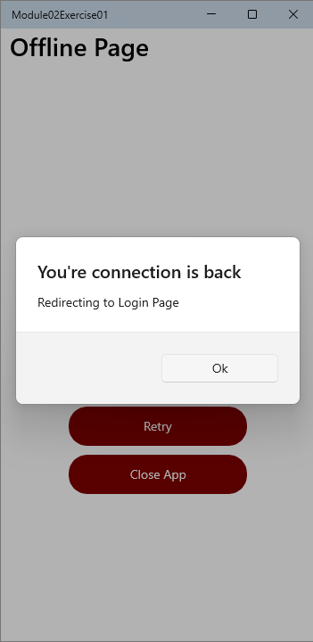
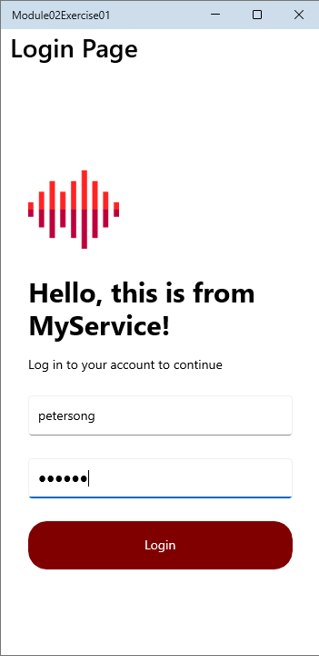
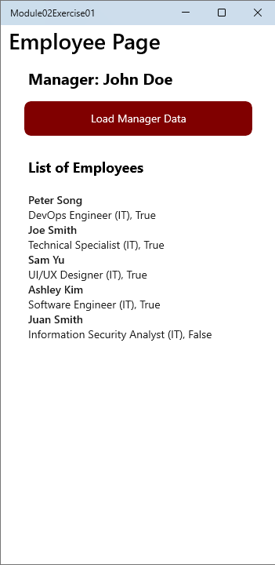

# PDC50-LAB Module 03-Exercise 01

### Offline Mode (OfflinePage)
  <table>
    <tr>
      <td></td>
      <td></td>
    </tr>
  </table>

### Online Mode (LoginPage, EmployeePage)
  <table>
    <tr>
      <td></td>
      <td></td>
      <td></td>
    </tr>
  </table>
